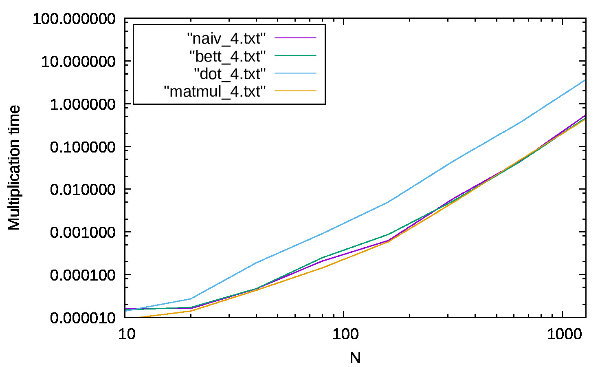
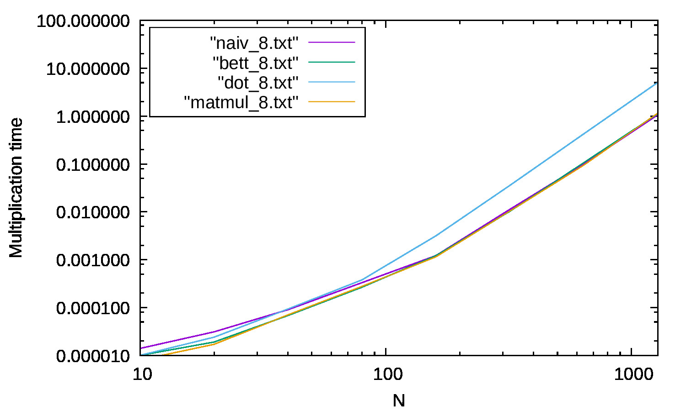
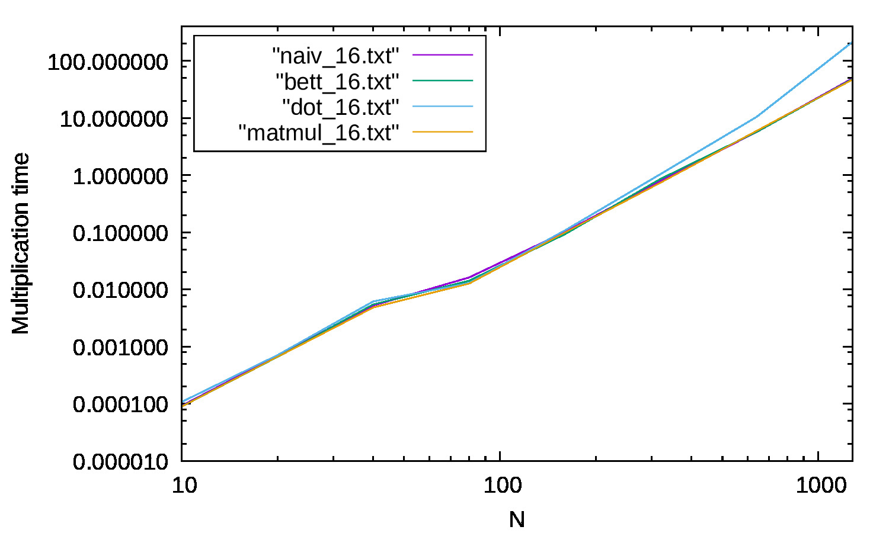

# Fortran - Mnożenie Macierzy
## Autor: Jakub Pilch
---
**1. Wstęp**

    Tematem projektu była implementacja oraz przetestowanie różnych metod mnożenia macierzy. W języku Fortran zostały zaimplementowane trzy metody:
    + naiwna
    + ulepszona - wykorzystująca ułożenie danych w pamięci
    + z iloczynem skalarnym - wbudowana funkcja dot_product
    Dodatkowo do porównania wzięto też pod uwagę wbudowaną funkcję Fortrana matmul(A,B).
---
**2. Testowane konfiguracje**

    Zmierzono czas wykonania każdej z metod dla:
    + typów real o precyzji: **4, 8, 16**
    + rozmiarów macierzy: **10, 20 ,40 ,80, 160, 320, 640, 1280**

**3. Wyniki pomiarów**

    Poniższe wykresy przedstawiają wyniki pomiarów dla poszczególnej precyzji typu real:

    **Kind = 4**
    
    **Kind = 8**
    
    **Kind = 16**
    